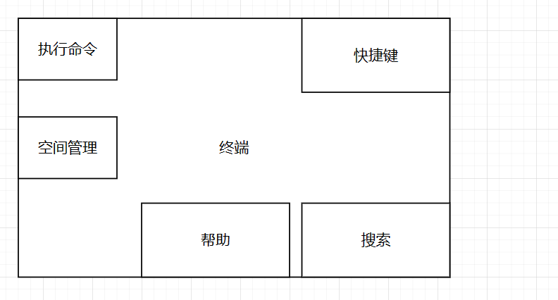
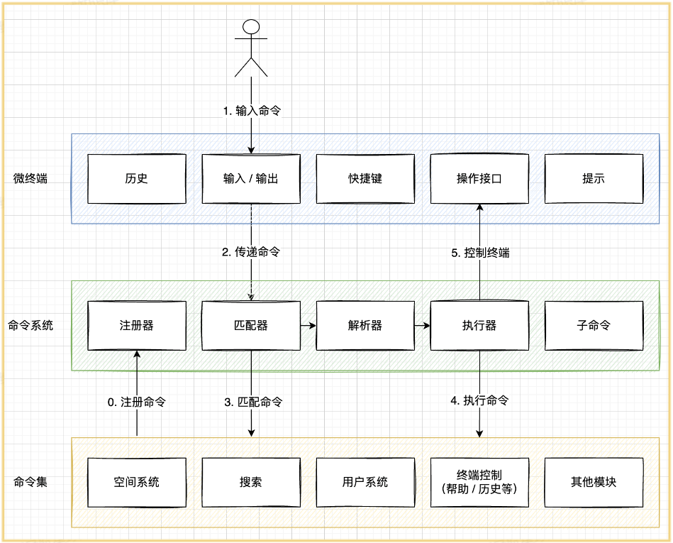

# web-terminal项目
## 启动项目
1. 先启动后端（请保证你的电脑中已经拥有Mysql、Redis并且它们的服务已经启动）
```shell
/server目录下执行
npm run start:dev
```

2. 启动前端（请保证你的电脑已经拥有Nodejs并且已经正确配置）

```shell
根目录/ 下执行
npm run dev
```


## 项目介绍

定位：程序员可定制化的浏览器主页（定制个人个性化的命令行）

开源地址：[zwf021123/IIndex: ✨ Vue3 + Nodejs 全栈项目，自实现web终端、命令系统 (github.com)](https://github.com/zwf021123/IIndex)


### 相比浏览器插件/软件的优势

插件和软件都是需要安装的

网页终端的优势在于免安装、易分发、易同步


### 技术选型

#### 前端

该项目前端开发占用85%的时间

主要技术：

-  Vue 3 前端开发，主流
- Vite 2 前端构建工具，新兴 / 优秀，本地编译速度很快，提高开发效率
- Ant Design Vue 3 组件库（不用 Element UI？用的熟练，ant design 主流，支持 vue 和 react，更通用）
- Pinia 2 状态管理（Vuex，pinia 兼容 vuex）
- TypeScript 类型控制（项目规范，编辑器 / 开发工具会给你提示问题）
- Eslint 代码规范控制（项目规范，自动语法校验）
- Prettier 美化代码（项目规范，自动格式化代码）

依赖库：

- axios 网络请求
- dayjs 时间处理
- lodash 工具库
- getopts 命令参数解析


#### 后端

主要技术：

- Node.js
- Express、express-session
- MySQL
- Sequelize（ORM 框架）
- Redis

依赖库：

- Axios
- 网易云音乐 NeteaseCloudMusicApi

依赖服务：

- 百度翻译 API
- 博天 API


### 亮点

项目名称：IIndex：程序员可定制化的web-terminal

项目描述：从0到1自实现的web终端项目，用户可以在一个页面通过命令即可快速完成所有操作，且开发者可以轻松自由地定制新命令

- 基于 Vue 3 + Vite + Ant Design 实现响应式 web 终端页面；基于 Node.js Express + Sequelize ORM 实现后端
- 考虑到系统较复杂，自主设计 web 终端、命令系统以及命令集 3 个子系统，使得整个系统逻辑清晰、职责分明
- web 终端模块：采用 Vue3 Composition API 向终端集成历史命令、提示、快捷键等功能，使系统更易于维护
- 命令系统：采用匹配 => 解析（getOps 库） => 执行机制实现，并通过递归的方式实现子命令解析
- 命令集：采用注册机制来维护命令集，并通过 TypeScript 来规范命令的定义，统一开发标准，减少代码冲突
- 为了更方便地管理用户配置（比如背景、提示语），使用 Pinia 全局管理器，实现多组件复用变量以及 LocalStorage 自动持久化
- 使用 ESLint + Prettier + TypeScript 配合 IDE 实现语法提示，统一项目规范，减少开发中的错误
- **仿 Linux 命令自实现文件系统，封装为空间命令，可以像管理文件一样管理已收藏的网站**


## 系统设计

### 最初构想



1. 为什么不放在一起？想象一下几千行的 if else 在一个文件里
2. 为什么需要命令集？（理想情况：每个命令单独一个文件）想象一下所有命令都在一个文件里，分工不便，不利于扩展，代码冲突
3. 为什么需要命令系统？集中处理解析命令、异常情况等


### 最终架构



什么是操作接口？

一组可以操作终端的API

为什么需要操作接口？

1. 控制哪些操作可以做
2. 解耦（如果可以直接访问，容易出现冲突）
3. 更清晰、明确

命令系统？

即一种设计模式


## 思路扩展

1. 增加更多实用的命令
2. 改变终端的用途（例如修改该终端为重后端的，比如远程操作Linus服务（前端传递命令，后端执行））
3. 命令市场，远程加载（类似uniapp的）
4. 修改为移动端版本
5. 将localStorage里的数据空间支持命令下载到本地，和从本地加载
6. 将空间数据与用户绑定同时存储到数据库中


## 仍存问题

- 部分命令不支持诸如cd /createDir/createDir2/ 
- 可选参数tab无法补全


